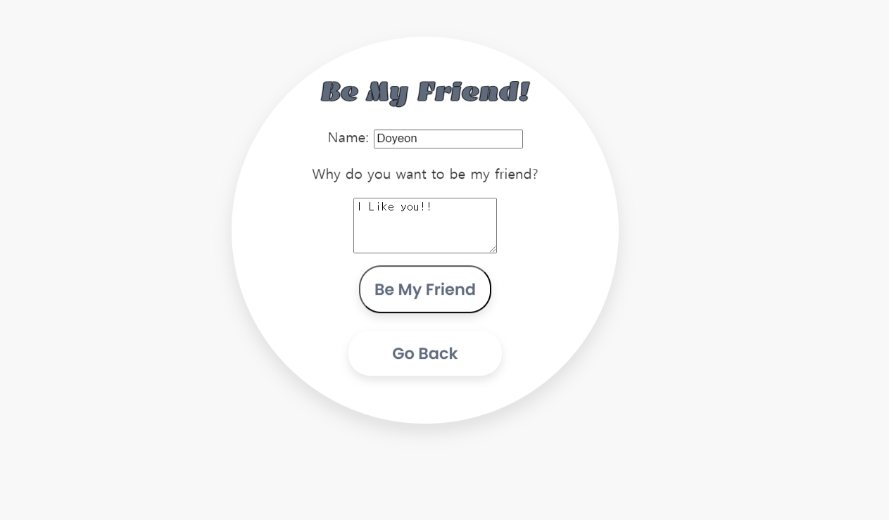
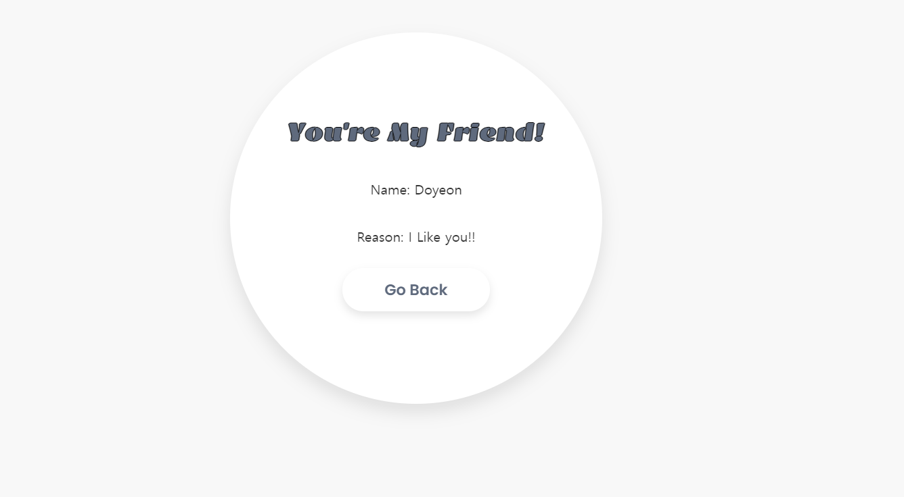
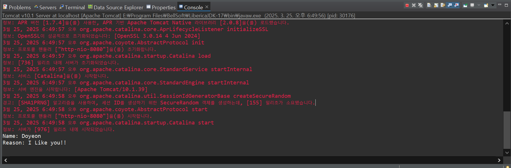

# 🌟 Self-Introduction Page with Friend Request Form 🌟

## 👋 Project Overview

Welcome to my **Self-Introduction Page**! This project is a simple HTML page hosted on Tomcat 10.1. Along with a brief self-introduction, I've added a **Friend Request Form** where users can submit their **name** and **reason for wanting to be friends**. When the form is submitted, the details are displayed in the **console**.

This project showcases a basic web application that integrates HTML for the user interface, Java for server-side processing, and **Tomcat 10.1** as the web server.

---

## 📸 Screenshot

Here’s a look at the self-introduction page with the **Friend Request Form**:

---

## 🖥️ Technology Stack

- **Java**: Used for the backend logic (Servlets).
- **Servlet**: For processing requests and handling form submissions.
- **Tomcat 10.1**: Web server to run the project.
- **HTML & CSS**: For designing the self-introduction page and form layout.
- **JavaScript**: To handle the form submission dynamically.

---

